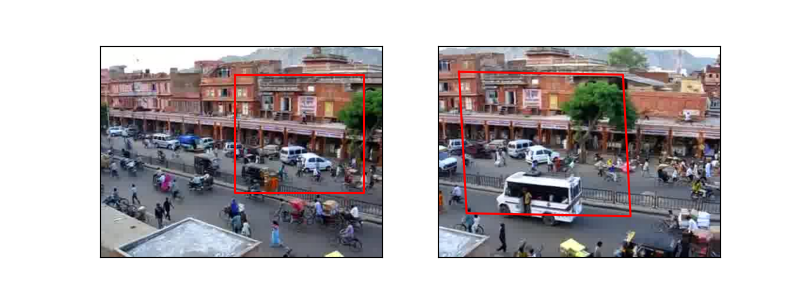
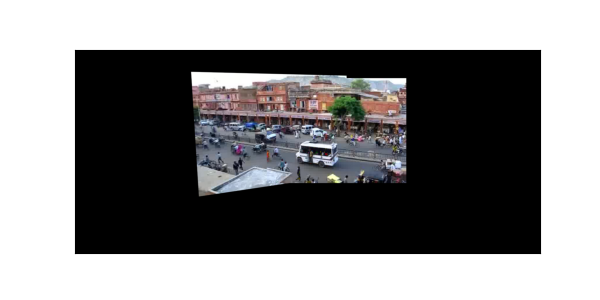
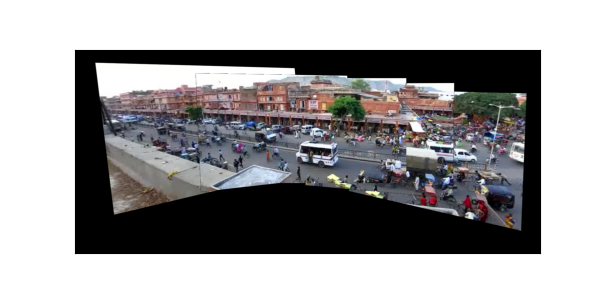
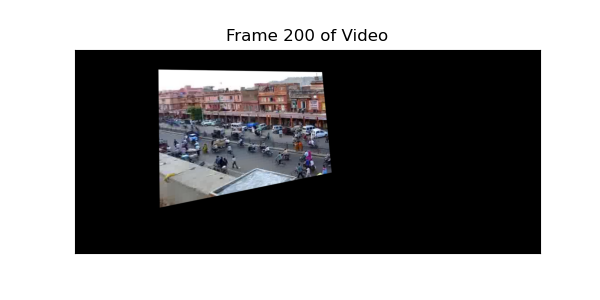
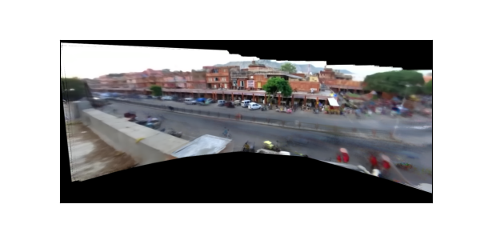
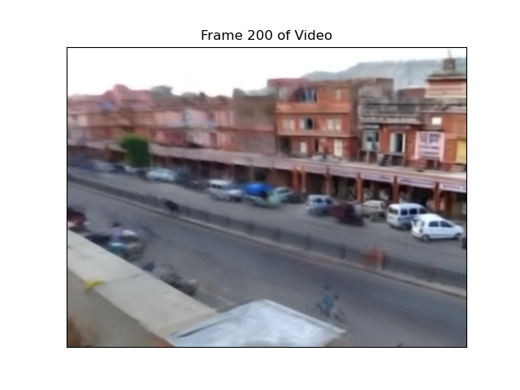
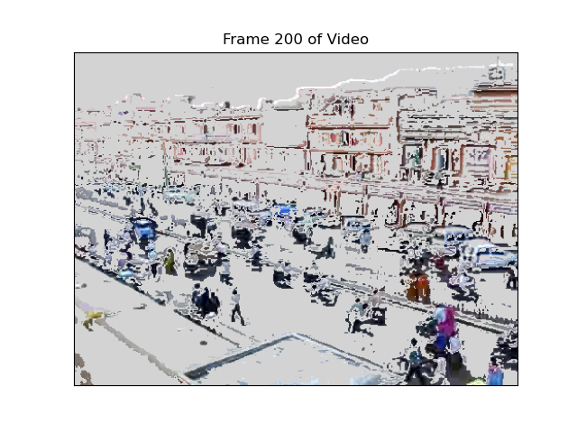

# Video Stitching and Processing

This project explores working with interest points, homographies, robust matching with RANSAC, and image projections. The project uses the first 30 seconds of this [video](https://www.youtube.com/watch?v=agI5za_gHHU), which has 900 frames. This project is based on this [assignment](https://yxw.cs.illinois.edu/course/CS445/Content/projects/video/ComputationalPhotograph_ProjectVideo.html) in computational photography at UIUC in spring 2023.

## Table of Contents
1. [Stitch Two Key Frames](#stitch-two-key-frames)
1. [Panorama Using Five Key Frames](#panorama-using-five-key-frames)
1. [Mapping the Video to the Reference Frame](#mapping-the-video-to-the-reference-frame)
1. [Creating the Background Panorama](#creating-the-background-panorama)
1. [Creating the Background Movie](#creating-the-background-movie)
1. [Creating the Foreground Movie](#creating-the-foreground-movie)

 

## Stitch Two Key Frames
In this part, frame 270 is stitched to reference frame 450 by: (1) computing the homography between frame 450 and frame 270; (2) projecting each frame onto the same surface; (3) blending the surfaces. Finding the homography involves detecting interest points in each image using the SIFT algorithm, and then using the RANSAC algorithm to match points. 

[Back to top](#table-of-contents)
 
 

## Panorama Using Five Key Frames
The five key frames [90, 270, 450, 630, 810] are stitched together using 450 as the reference frame to create a panorama. Frames 270 and 630 can be mapped directly to frame 450. Frame 90 and 810 cannot easily be mapped directly to frame 450 since they share very little area with frame 450. Instead, they can first be mapped to the nearest key frame and then can be mapped to frame 450. For example, suppose $H_{90, 270}$ is the homography between frames 90 and 270, and $H_{270, 450}$ is the homography between frames 270 and 450, then the mapping from frame 90 to 450 is defined as $H_{90, 450}=H_{90, 270} \times H_{270, 450}$.

[Back to top](#table-of-contents)
 
 

## Mapping the Video to the Reference Frame
In this part, all frames are projected onto the same plane as frame 450 to create a video. This entails estimating a homography for each frame. If a homography cannot be mapped to frame 450 directly, it is first mapped to the nearest key frame (one of the frames from part 2) and then mapped to frame 450. Cutoffs for which key frame to map to were determined by calculating the homography of a frame to each of its neighboring key frames and then comparing how many points match. Frames between 348 and 564 inclusive are mapped directly frame 450. Frames 1-201 are first mapped to frame 90, frames 202-347 are first mapped to frame 270, frames 565-719 are first mapped to frame 630, frames 720-900 are first mapped to frame 810.

[Video](https://youtu.be/4xxIU9A1jrM)

[Back to top](#table-of-contents)
 
 

## Creating the Background Panorama
I used the median of non-zero values across all frames of the video for a pixel to extract the background. Since the background is fixed, the value of a pixel corresponding to the background should be unchanged unless a foreground object briefly moves in front of it. Therefore, the background color for each pixel can be estimated by finding the most common value for each pixel. 

[Back to top](#table-of-contents)
 
 

## Creating the Background Movie
Creating the background movie requires mapping each frame from the background panorama to movie coordinates. The inverse of each frames’ homograpy is taken and then applied to the frame, which maps from the panorama to the movie coordinates.

[Video](https://youtu.be/Yt2wuWL1N7A)

[Back to top](#table-of-contents)
 
 

## Creating the Foreground Movie
The foreground can be thought of as the difference between the original movie and background movie. Pixels similar to the background will have a small difference while foreground objects will have a large difference. A threshold of absolute value of 30 is used. Background pixels are assigned 211, so that the background in the foreground movie is a light gray.

[Video](https://youtu.be/K9GYgXl6m88)

[Back to top](#table-of-contents)
 
 